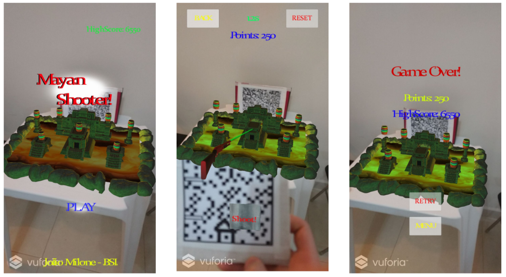
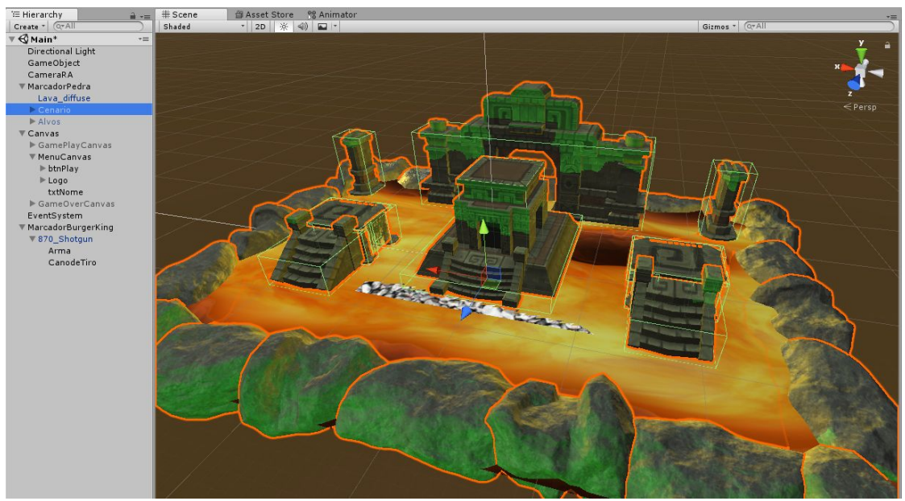
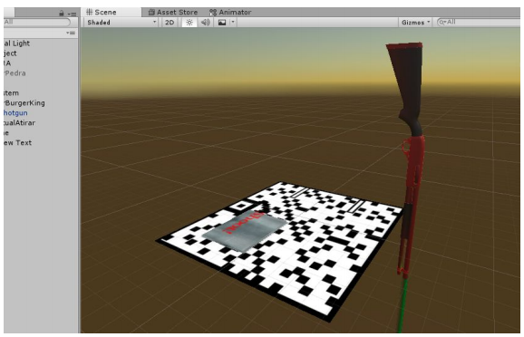
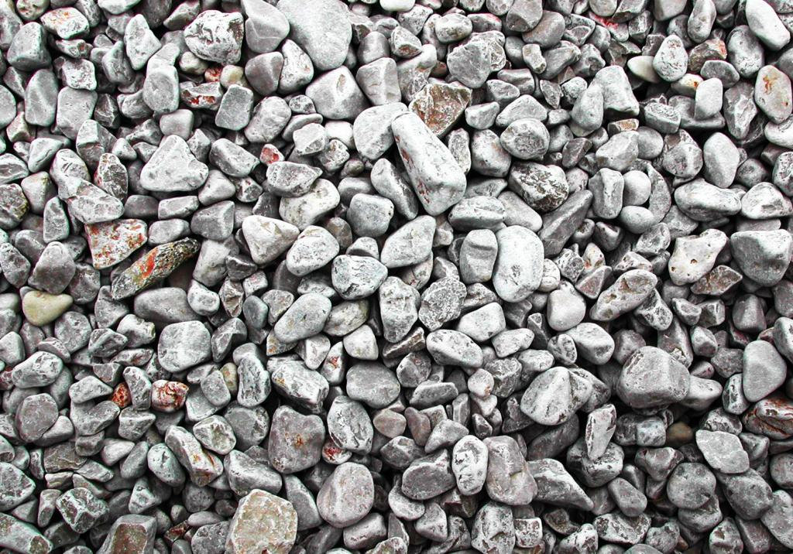

# VR_Unity_Vuforia_TargetShooter

Created this back in 2017 in with Unity + Vuforia ported for Android!

- Its a simple target shooter, where you have a target image for the scenary. 
- A target image for your gun, to shoot the gun you must activate a virtual button on the gun target.

### - Screnshots:

### - View in Unity:

### - Targets used for tracking:

#### Target used for scenary:

#### Target used for gun:

<strong> APK </strong> and Documentation (Portuguese) is included in files.
